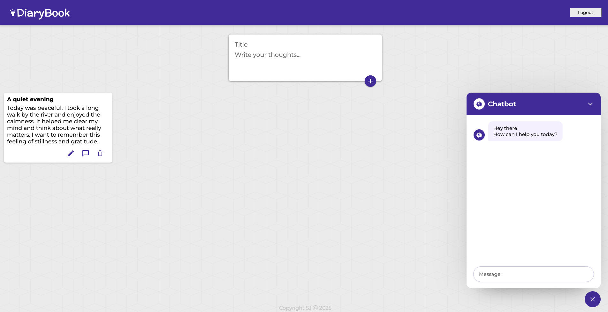

# DiaryBook

## Description
DiaryBook is a full-stack application where users can securely store, manage, and reflect on their personal thoughts and diary entries. Built with Node.js, Express, and PostgreSQL on the backend, and React on the frontend, it features JWT-based authentication to protect user data.

Now with Gemini Chatbot!
Integrated Gemini chatbot acts as your intelligent assistant, helping you to capture, organize, and explore your daily thoughts and reflections — making your diary experience more interactive and personalized.

## Features
- User registration & login (JWT authentication)
- CRUD operations for quotes
- Random quote retrieval
- Secure user data with bcrypt password hashing
- Interactive Gemini chatbot to assist with diary writing and thought organization

## Technologies
- Backend: Node.js, Express, PostgreSQL
- Frontend: React
- Authentication: JWT
- Password hashing: bcrypt
- Chatbot: Gemini AI integration

## Installation

### Backend Setup
1. Create `.env` file:
   ```env
   PG_USER=your_user
   PG_HOST=localhost
   PG_DATABASE=dairy_book
   PG_PASSWORD=your_password
   PG_PORT=5432
   TOKEN_SECRET=your_token_secret
   ```

2. Install dependencies:
   ```bash
   npm install
   ```

3. Set up PostgreSQL:
   ```sql
   CREATE DATABASE diary_book;
   ```

4. Run the development server:
   ```bash
   node index.js
   ```

### Frontend Setup

1. Install frontend dependencies:
   ```bash
   npm install
   ```

2. Run frontend in development mode:
   ```bash
   npm run dev
   ```
   This will start the React development server, typically on `http://localhost:5173`.

## Running the Application

- **Backend**: `http://localhost:3000`
- **Frontend**: `http://localhost:5173`

### Database Structure

```sql
CREATE TABLE users (
    id SERIAL PRIMARY KEY,
    username TEXT,
    email TEXT UNIQUE,
    password TEXT
);

CREATE TABLE my_notes (
    id SERIAL PRIMARY KEY,
    title TEXT,
    content TEXT,
    user_id INT,
    FOREIGN KEY (user_id) REFERENCES users(id)
);
```

## API Endpoints
- **POST** `/register`: Register a new user
- **POST** `/login`: Login with email and password
- **GET** `/all/:id`: Get all notes for a user
- **GET** `/random`: Get a random note
- **POST** `/notes/:id`: Add a new note
- **PUT** `/notes/:id`: Edit an existing note
- **DELETE** `/notes/:id`: Delete a note

## Screenshots

### Login Page


### Register Page


### Dashboard



## Author
- GitHub - [@SebastianJast](https://github.com/SebastianJast)
- Website - [Sebastian](https://sebastianjast.github.io/Responsive_CV/)