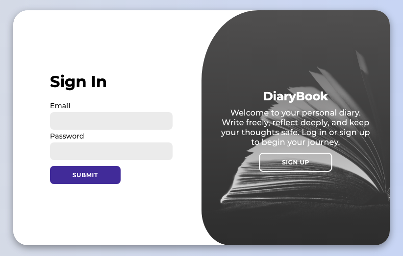
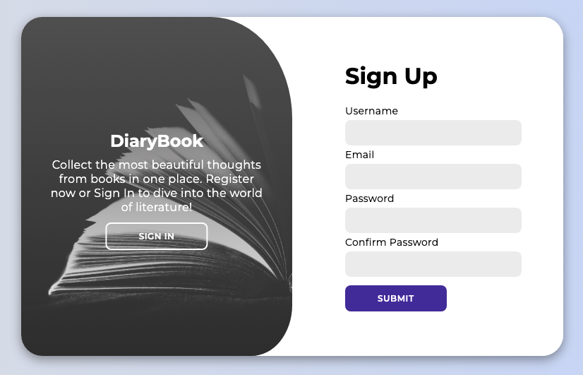

# QuoteBook

## Description
QuoteBook is a full-stack application where users can store, manage, and view their personal quotes. Built with Node.js, Express, PostgreSQL for the backend, and React for the frontend, with JWT-based authentication.

## Features
- User registration & login (JWT authentication)
- CRUD operations for quotes
- Random quote retrieval
- Secure user data with bcrypt password hashing

## Technologies
- Backend: Node.js, Express, PostgreSQL
- Frontend: React
- Authentication: JWT
- Password hashing: bcrypt

## Installation

### Backend Setup
1. Create `.env` file:
   ```env
   PG_USER=your_user
   PG_HOST=localhost
   PG_DATABASE=quote_book
   PG_PASSWORD=your_password
   PG_PORT=5432
   TOKEN_SECRET=your_token_secret
   ```

2. Install dependencies:
   ```bash
   npm install
   ```

3. Set up PostgreSQL:
   ```sql
   CREATE DATABASE quote_book;
   ```

4. Run the development server:
   ```bash
   node index.js
   ```

### Frontend Setup

1. Install frontend dependencies:
   ```bash
   npm install
   ```

2. Run frontend in development mode:
   ```bash
   npm run dev
   ```
   This will start the React development server, typically on `http://localhost:5173`.

## Running the Application

- **Backend**: `http://localhost:3000`
- **Frontend**: `http://localhost:5173`

### Database Structure

```sql
CREATE TABLE users (
    id SERIAL PRIMARY KEY,
    username TEXT,
    email TEXT UNIQUE,
    password TEXT
);

CREATE TABLE my_notes (
    id SERIAL PRIMARY KEY,
    title TEXT,
    content TEXT,
    user_id INT,
    FOREIGN KEY (user_id) REFERENCES users(id)
);
```

## API Endpoints
- **POST** `/register`: Register a new user
- **POST** `/login`: Login with email and password
- **GET** `/all/:id`: Get all notes for a user
- **GET** `/random`: Get a random note
- **POST** `/notes/:id`: Add a new note
- **PUT** `/notes/:id`: Edit an existing note
- **DELETE** `/notes/:id`: Delete a note

## Screenshots

### Login Page



### Register Page



### Dashboard


## Author
- GitHub - [@SebastianJast](https://github.com/SebastianJast)
- Website - [Sebastian](https://sebastianjast.github.io/Responsive_CV/)